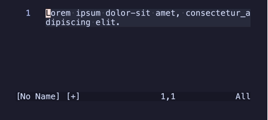
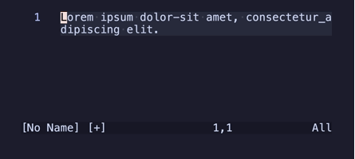
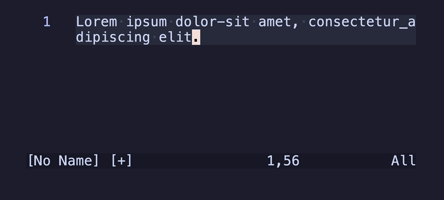
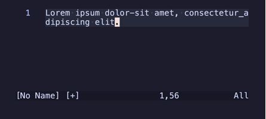
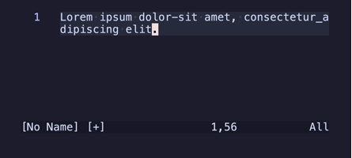
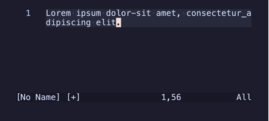
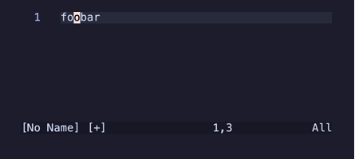
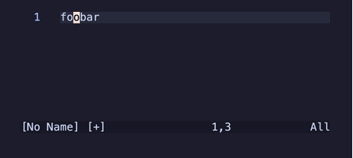

---
tags:
  - vim
  - learning
  - teaching
---
## Goals

By the end of this week, you should:
- Understand the status bar’s role in indicating the current Vim mode.
- Understand the concept of **Normal Mode** and how it differs from **Insert/Editing Mode**.
- Learn how to switch between these modes using specific keys.
- Know the basic word motions for navigating text efficiently.
- Build confidence in using **Normal Mode** for text navigation and **Insert Mode** for text entry.
- Use simple undo command

---
## Lesson

### Modes Overview

**==Normal== Mode**: This is Vim’s default mode. When you first open a file in Vim or Neovim, you start in Normal Mode. In this mode, you navigate, delete, copy, and modify text without typing any new content. Think of Normal Mode as your command center - here, you give instructions to Vim on what to do with the text. For example, you can delete words, copy lines, or move quickly across the document using motions. To enter Normal Mode, you press `Esc`.

**==Insert== Mode**: This mode is used for typing and inserting new text, similar to traditional editors. You enter Insert Mode using one of several keys (`i`, `I`, `a`, `A`, `o`, `O`), each offering a slightly different way to start inserting text relative to the current cursor position. Once you’re done typing, press `Esc` to return to Normal Mode. Unlike Normal Mode, where you give commands, Insert Mode focuses entirely on content creation.

#### ⚠️ Important Note

While it's essential for text entry, it's equally important to view insertions as discrete actions. After completing a specific insertion, returning to **Normal Mode** by pressing `Esc` is a best practice.

##### Why Return to Normal Mode?

- **Efficient Navigation and Editing**: Normal Mode offers powerful commands for navigation and text manipulation that aren't available in Insert Mode. By returning to Normal Mode, you can swiftly move through the document and perform edits without unnecessary keystrokes.
- **Command Repetition**: Vim's `.` command repeats the last change made in Normal Mode. By exiting Insert Mode after each insertion, you enable the use of this feature, enhancing efficiency when applying the same change multiple times. (we will learn about this in the future)
- **Mode Awareness**: Consistently returning to Normal Mode reinforces the habit of mode awareness, a fundamental aspect of Vim's modal editing philosophy. This practice reduces errors and increases editing speed.
- **Undo/Redo**: by making discrete/atomic changes you can better utilize the sophisticated Vim's undo and redo functionality

##### Best Practices for Insert Mode:

- **Group Insertions**: Complete a logical chunk of text, then press `Esc` to return to Normal Mode. This approach keeps insertions organized and allows for immediate navigation or command execution.
- **Avoid Staying in Insert Mode**: Remaining in Insert Mode after finishing an insertion can lead to inefficiencies and potential errors. Normal Mode is designed for navigation and command execution, so utilize it accordingly.

By treating insertions as distinct actions and habitually returning to Normal Mode, you align with Vim's design principles, leading to a more efficient and error-free editing experience.

Basically, insert mode is the almost the same as standard editing you are used to. So this will probably be the hardest lesson as it requires a complete mental change from how you are used to edit files to constantly keep going back to normal mode (from any other mode, not just insert).

You can always disable the vscode-neovim extention if it gets too much.

### Keys and Usage

### Status Bar

The status bar at the bottom should show useful information as well as the current working ==mode==


### Cursor
Usually the cursor in Vim is displayed as a block highlighting a whole character 


### Switching to Normal

- `Esc`: Return to Normal Mode from any other mode.

### Arrow Motions
#### The `hjkl` and Arrow Keys

The `hjkl` keys are used to move the cursor in Normal Mode:
- **`h`**: Move left (←)
- **`j`**: Move down (↓)
- **`k`**: Move up (↑)
- **`l`**: Move right (→)

The arrow keys (`←`, `↓`, `↑`, `→`) can also be used for navigation in Vim. While they may feel familiar to new users, they are considered less efficient for experienced Vim users.
#### Why `hjkl` is Preferred?

- **Home Row Efficiency**: These keys are positioned on the home row of the keyboard, meaning your fingers never have to leave their resting position. This allows for faster navigation compared to moving your hands to the arrow keys.
- **Integrated with Vim Motions**:  The hjkl keys integrate seamlessly with Vim's operators and motions. This synergy is harder to achieve with arrow keys.
- **Consistent Across Systems**: The hjkl keys work in any Vim or Neovim environment, even those without functional arrow keys (e.g., some terminal setups).
- **Faster Editing**: By staying on the home row, you reduce hand movement, making navigation faster and minimizing strain during long editing sessions.
#### **Why Avoid Arrow Keys?**
1. **Hand Movement**: Using arrow keys requires lifting your fingers off the home row, which disrupts typing flow and slows down navigation.
2. **Discourages Vim Philosophy**: Relying on arrow keys prevents you from embracing Vim’s modal editing philosophy and the efficiency offered by combining motions with commands.
3. **Limited in Range**: Arrow keys only move one step at a time, whereas `hjkl` can be combined with counts or used in conjunction with other motions (`w`, `b`, `e`, etc.) to navigate text more intelligently.

Do not feel ashamed if you want to stick to arrow keys for now. I also still find them kind of confusing after 3 decades of using the arrow keys 😅

### **Word** Motions (Normal Mode)

Motions are commands that move the cursor position. Here are most of the word based motions:

- `w`: ==word== : Jump forward to the beginning of the next word.
	

- `W`: ==Word no whitespaces== Jump forward to the beginning of the next word, ignoring punctuation.
	
	
- `b`: ==back== : Jump backward to the beginning of the current/previous word.
	

- `B`: ==Back no whitespaces== : Jump backward to the beginning of the current/previous word, ignoring punctuation.
	

- `e`: ==end== : Jump forward to the end of the current/next word.
	

- `E`: ==End no whitespaces== : Jump forward to the end of the current/next word, ignoring punctuation.
	

- `ge`: ==end backwards== : Jump backward to the end of the previous word.
	

- `gE`: ==end backwards no whitespaces== : Jump backward to the end of the previous word, ignoring punctuation.
	

### Insert Mode Keys
To prepare for this we will start with a new file, press `i` → type `foobar` → press `Esc` and move to the second `o`.
After pressing `Esc` when testing each insert key, you can press `u` one to return to `foobar` (we will go deeper in the undo at later week)

Try each command on your own a few time to better understand how it works.

- `i` ==insert== : Enters Insert Mode **on** the cursor position.
	`foo|bar` → Press `i` → Type `hello`  → Press `Esc` → `fohello|obar`.
	
	
- `I` ==Insert at the beginning== : Enters Insert Mode at the **beginning** of the current line (right before first non whitespace character)
    `foo|bar` → Press `I` → Type `hello` → Press `Esc` → `hellofoobar`.
    

- `a` ==append== : Enters Insert Mode **after** the cursor.
    `foo|bar` → Press `a` → Type `hello` → Press `Esc` → `foohello|bar`.
	

- `A` ==Append at the end== : Enters Insert Mode at the **end** of the current line.
    `foo|bar` → Press `A` → Type `hello` → Press `Esc` → `foobarhello|`.
    

- `o` ==open line== Creates a **new line below** the current one and enter Insert Mode.
    `foo|bar` → Press `o` → Type `hello` → Press `Esc` →
	```
	foobar
	hello|
	```
	

- `O` ==Open line above== Creates a **new line above** the current one and enter Insert Mode.
    `foo| bar` → Press `o` → Type `hello` → Press `Esc` →
	```
	hello|
	foobar
	```
	


### Changes and Undo Command

#### What is a Change?

In Vim, most actions that modify the text are considered **changes**, meaning they are recorded in Vim’s undo history. This includes:

- Deleting, changing text from normal mode.
- Text insertions made in **Insert Mode**.
- Replacing characters in replace mode.
- We will learn more.

Each change and sometimes a group of changes is recorded as a single step in the undo history. For example: Typing several words in a single Insert Mode session (before returning to Normal Mode) is grouped as one undoable change. This makes undoing changes very efficient and more importantly predictable.

#### The `u` Command

The `u` command is used to undo change. You can repeatedly press `u` to continue undoing earlier changes.

#### Tips for Using `u`

- Changes made in Insert Mode are grouped into a single undo step. Exit Insert Mode (`Esc`) after completing logical changes to keep them grouped.
- For efficient undoing, keep your Insert Mode sessions focused on specific edits. This helps you track and manage undoable changes better.
- If you undo too many steps, you can redo the changes using `Ctrl-r`. (r for ==redo==)

### Extra Tips
- **Mnemonics**: As you can see there is an easy mnemonics for these command so there is almost nothing to remember.
- **Pattern**: You may have noticed but there is a logical pattern for capital letter commands.
- **When in doubt, hit `Esc`!**
    - Pressing `Esc` multiple times ensures you return to Normal Mode in most scenarios.
- **Instead of Escape**: Since Esc is not in the most convenient place there are other options:
	- You can remap the caps-lock to Esc. I personally find the caps-lock completely useless, but at nice place to press with my pinky and this is my favorite options. You can google how to do this from your OS.
	- People commonly remap `jj` or `jk` as escape - this is easy to do in vim we will cover this later or you can google it now if you are interested in this approach it is really easy to do.

---

## **CheatSheet**

**Modes**:
- `Esc`: Enter Normal Mode.

**Enter Insert Mode**:
- `i`, `I`: insert
- `a`, `A`: append
- `o`, `O`: open line

**Word Motions**:
- `w`, `W`: word (with/without punctuation).
- `b`, `B`: back word (with/without punctuation).
- `e`, `E`: end of word (with/without punctuation).
- `ge`, `gE`: end of previous word (with/without punctuation).

**Undo/Redo**
- `u`: undo
- `C-r`: redo

---

## Exercises

Here’s a sample text you can use for the exercises:
```
The quick brown fox jumps over the lazy dog. 
Lorem ipsum dolor sit amet, consectetur adipiscing elit. 
Vivamus luctus urna sed urna ultricies ac tempor dui sagittis. 
Integer vel nisi-id arcu_viverra vehicula eget ac odio.
```

When you are in normal mode you can press `u` to undo your last change, you can also use the hjkl keys, arrow keys or the mouse for this exercise

### **Exercises: Word Motions**

#### **Exercise: `w` (Move forward to the beginning of the next word)**
1. Start at the beginning of the first line and move the cursor to "fox" using only `w`.
2. Start at the word "Lorem" in the second line and move to "consectetur" using only  `w`.
3. Navigate from "Integer" to "vehicula" on the fourth line using only `w`.

#### **Exercise: `W` (Move forward to the beginning of the next word, ignoring punctuation)**
1. Start at the beginning of the first line and move the cursor to "fox" using only `W`.
2. 2. Start at the word "Lorem" in the second line and move to "consectetur" using only  `W`.
3. Navigate from "Integer" to "vehicula" on the fourth line using only `W`.

#### **Exercise: `b` (Move backward to the beginning of the current/previous word)**
1. Start at the word "over" in the first line and move backward to "brown" using `b` twice.
3. Navigate from "vehicula" in the fourth line back to "Integer" using only `b`.
3. Start at "adipiscing" in the second line and move to "Lorem" using `b`.

#### **Exercise: `B` (Move backward to the beginning of the current/previous word, ignoring punctuation)**
1. Start at "tempor" in the third line and move to "Vivamus" using `B`.
2. From "consectetur" in the second line, move to "Lorem" using `B` repeatedly.
3. Navigate from "vehicula" in the fourth line back to "Integer" using only `B`.

#### **Exercise: `e` (Move forward to the end of the current/next word)**
1. Start at "The" in the first line and move to "brown" using `e` twice.
2. Move from "Integer" to the end of "eget" in the second line using `e` repeatedly.
3. Start at "Vivamus" and move to "ultricies" in the third line using only `e`.

#### **Exercise: `E` (Move forward to the end of the current/next word, ignoring punctuation)**
1. Start at "Lorem" in the second line and move to the end of "adipiscing" using `E` repeatedly.
2. Move from "Integer" to the end of "eget" in the second line using `E` repeatedly.
3. Move from "brown" to the end of "dog" in the first line using `E`.

#### **Exercise: `ge` (Move backward to the end of the previous word)**
1. Start at "dog" in the first line and move to "jumps" using `ge` repeatedly.
2. Place the cursor on "vehicula" in the forth line and move back to "Integer" using `ge` repeatedly.
3. Move from "sagittis" in the third line to "Vivamus" using `ge`.

#### **Excercise: `gE` (Move backward to the end of the previous word, ignoring punctuation)**
1. Start at "vehicula" in the fourth line and move back to "Integer" using `gE`.
2. From "adipiscing" in the second line, move to "Lorem" using `gE` repeatedly.
3. Navigate from "dog" in the first line back to "brown" using only `gE`.

### **Exercises: Insert Mode Keys**

When you are back in normal mode you can press `u` to undo a change.
#### **Exercise: `i` (Insert before the cursor)**
1. Place the cursor on the word "quick" and add the word "very" before it. Go back to Normal mode
    - Result: `The very quick brown fox jumps over the lazy dog.`
2. Place the cursor on the word "consectetur" and type `NOT`. Go back to Normal mode
    - Result: `Lorem ipsum dolor sit amet, NOTconsectetur adipiscing elit.`
4. Insert the text "Hello! " at the start of the second line. Go back to Normal mode
    - Result: `Hello! Lorem ipsum dolor sit amet, consectetur adipiscing elit.`

#### **Exercise: `I` (Insert at the beginning of the line)**
1. Move to the third line and add "NOTE: " at the beginning. Go back to Normal mode
    - Result: `NOTE: Vivamus luctus urna sed urna ultricies ac tempor dui sagittis.`
2. Add "INFO: " at the start of the fourth line. Go back to Normal mode
    - Result: `INFO: Integer vel nisi-id arcu_viverra vehicula eget ac odio.`
3. Insert "=> " at the start of the first line. Go back to Normal mode
    - Result: `=> The quick brown fox jumps over the lazy dog.`

#### **Exercise: `a` (Insert after the cursor)**
1. Place the cursor on "jumps" and add the word "high" after it.
    - Result: `The quick brown fox jumps high over the lazy dog.`
2. Place the cursor on "tempor" and add "is important" after it.
    - Result: `Vivamus luctus urna sed urna ultricies ac tempor is important dui sagittis.`
3. Move to the end of "dog." and add " Isn't it?".
    - Result: `The quick brown fox jumps over the lazy dog. Isn't it?`

#### **Exercise: `A` (Insert at the end of the line)**
1. Move to the first line and append " (sentence one)".
    - Result: `The quick brown fox jumps over the lazy dog. (sentence one)`
2. Add " [done]" to the end of the second line.
    - Result: `Lorem ipsum dolor sit amet, consectetur adipiscing elit. [done]`
3. Append " – important details" to the third line.
    - Result: `Vivamus luctus urna sed urna ultricies ac tempor dui sagittis. – important details`

#### **Exercise: `o` (Insert on a new line below)**
1. Place the cursor anywhere on the first line and create a new line below with "This is a new line.".
    - Result:    
	```
	The quick brown fox jumps over the lazy dog.
	This is a new line.
	```
        
2. Create a new line below the second line with "Additional information here.".
    - Result:
    ```
	Lorem ipsum dolor sit amet, consectetur adipiscing elit.
	Additional information here.
	```
        
3. Add a new line below the fourth line and type "End of document.".
    - Result:
	```
	Integer vel nisi id arcu viverra vehicula eget ac odio.
	End of document.
	```

#### **Exercise: `O` (Insert on a new line above)**
1. Place the cursor anywhere on the third line and add a new line above with "Header line:".
    - Result:
	```
	Header line:
	Vivamus luctus urna sed urna ultricies ac tempor dui sagittis.
	```
        
2. Add a new line above the first line with "Start:".
    - Result:
	```
	Start: The quick brown fox jumps over the lazy dog.```
	```
        
3. Insert a blank line above the fourth line and type "Section Divider".
    - Result:
	```
	Integer vel nisi id arcu viverra vehicula eget ac odio. Section Divider
	```

---

## **Practice**

**Switching Modes**:
- Use Insert commands to enter text at different positions.
- After each insert press escape to go back to normal mode and navigate there

**Using Word Motions**:
- Focus on navigating horizontally with using all word motions.

**Undo/Redo**
- Use vim undo and redo instead of built in vscode undo/redo

---
## **Further Reading**

- [Insert Mode](https://neovim.io/doc/user/insert.html#inserting)
- [Word Motions](https://neovim.io/doc/user/motion.html#_4.-word-motions)
